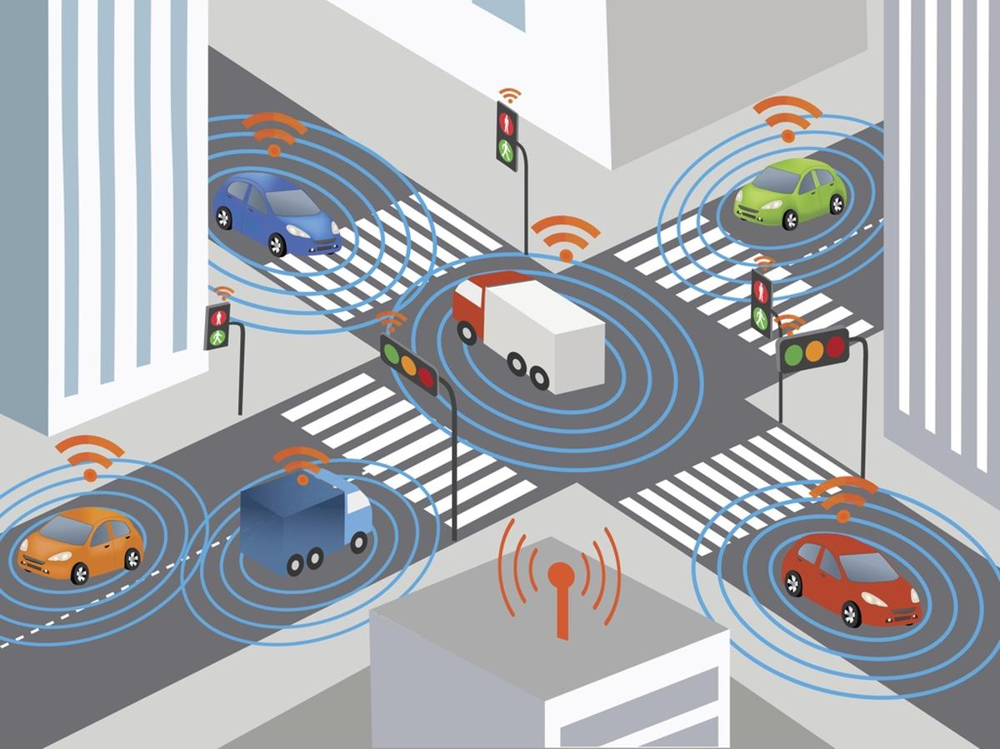
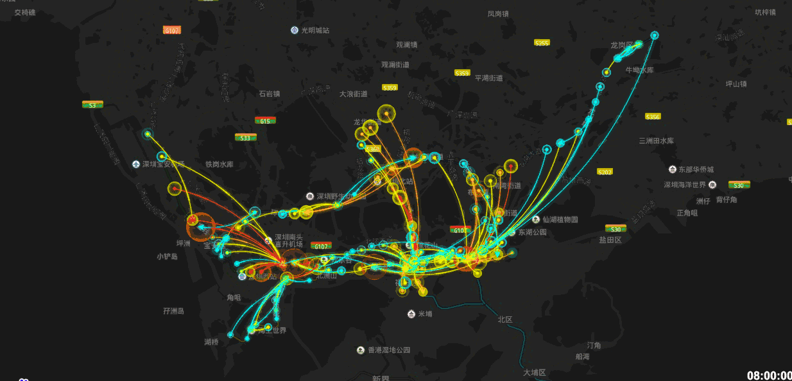

<table style="width:100%; font-size:22px;">
    <thead>
	<tr>
		<th width="40%">
			<a href="http://www.humanbusiness.eu/purpose-venn-diagram/">Research Aim</a> </th>
		<th width="60%">Explore the Unknown</th>
	</tr>
    </thead>
	<tbody>
		<tr id="row2col1" class="entry">
			<td> 
			</td>
			<td>But why, some say, the moon?   Why choose this as our goal?   And they may well ask why climb the highest mountain?   Why, 35 years ago, fly the Atlantic?   Why does Rice play Texas?   We choose to go to the moon.    We choose to go to the moon in this decade and do the other things,   not because they are easy, but because they are hard.    ---<cite> John F. Kennedy - <a href="https://er.jsc.nasa.gov/seh/ricetalk.htm">Moon Speech</a> - September 12, 1962</cite> 
			</td>
		</tr>
	</tbody>
</table>      

<!---->

# RESEARCH INTEREST
-----

<table style="width:100%; font-size:22px;">
    <thead>
	<tr>
		<th width="25%">Highlight</th>
		<th width="25%">Topic</th>
		<th width="50%">Detail</th>
	</tr>
    </thead>
	<tbody>
		<tr id="interest1" class="entry">
		      <td>
			  
		      </td>
		      <td><mark>人工智能+交通群体智能控制</mark></td>
		      <td><mark>深度强化学习技术</mark>   <mark>智能交通群体管控</mark>  <mark>LLM-VLM技术</mark>  自动化控制技术  交通仿真二次开发   优化理论及技术 
			       <!-- 
 [<a href="javascript:toggleInfo('interest1','abstract')">Abstract</a>]
				 [<a href="https://ieeexplore.ieee.org/abstract/document/8956222">PDF</a>] 
				  [<a href="http://tps.uwstarlab.org/">Website</a>]
			      
-->
		       </td>
		</tr>
		<tr id="interest3" class="entry">
			<td>
				</td>
			<td> 网联自主交通系统</td>
			<td><mark>控制及仿真技术：自动驾驶控制技术及仿真测试、无人机系统管控</mark>   I am highly interested in technologies which could change the future of transportation. Including but not limited to: Intelligent transport system control; Sharing mobility; Smart parking; Congestion mitigation.. 
			</td>
		</tr>
		<tr id="interest2" class="entry">
			<td>  </td>
			<td> 交通大数据分析 Big Data Analytics & Statistics </td>
			<td><mark>统计、机器学习及数据平台开发:城市级轨迹数据及省级出行数据分析</mark>  Transportation safety data analysis; Discrete choice modeling; Machine learning and artificial intelligence. I am also highly interested in the developing data mining technology. 
			</td>
		</tr>
	</tbody>
</table>      

# SELECTED RESEARCH
-----

# METHODOLOGIES
-----
<table style="width:100%; font-size:22px;">
    <thead>
		<tr>
			<th width="25%">Statement</th>
			<th width="50%">Topic</th>
			<th width="25%">Detail</th>
		</tr>
    </thead>
	<tbody>
	    <tr id="m1" class="entry">
		<td>In Developing</td>
	      <td>Car follwing model for intellegent vehicles.
		<!-- 
		

		  
		  

		  Connected and Autonomous Vehicle
		  
 
		
-->
	      </td>
		<td>paper1, paper2</td>
	</tr>
	<tr id="m2" class="entry">
		<td>In Developing</td>
		<td>Car pltooning technology for intelligent vehilces </td>
		<td>paper1, paper2</td>
	</tr>
	<tr id="m3" class="entry">
		<td>In Developing</td>
		<td>Random parameter discrete model </td>
		<td>paper1, paper2</td>
	</tr>
	<tr id="m4" class="entry">
		<td>Developed</td>
		<td>Discrete choice model: logit model (MNL, MXL; OL, PPO) </td>
		<td>Clustering: Latent class analysis/clustering</td>
	</tr>
	<tr id="m5" class="entry">
		<td>Developed</td>
		<td>Spatiotemporal analysis: Spatiotemporal cube analysis </td>
		<td>paper1, paper2</td>
	</tr>
	</tbody>
</table>        
