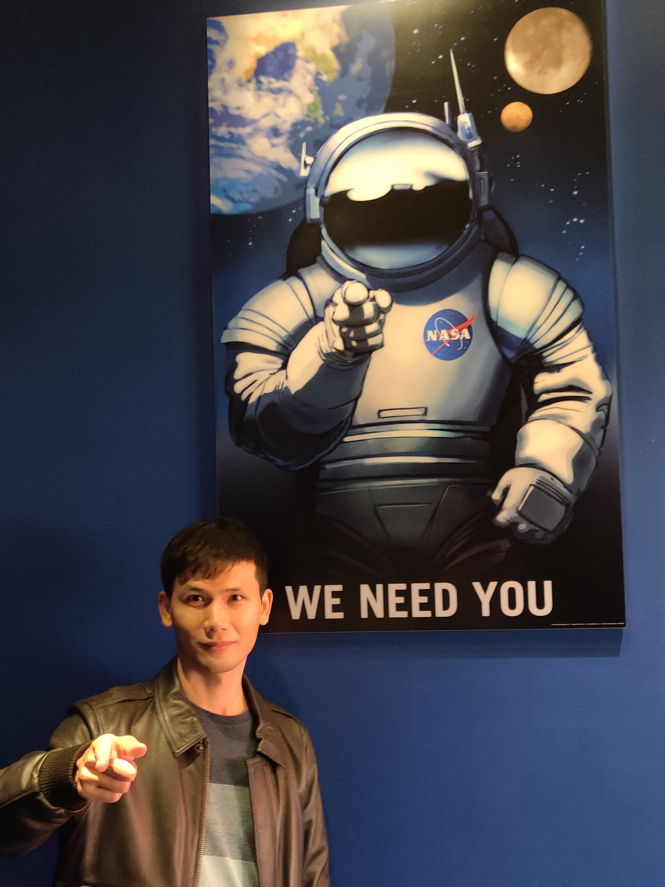

    

## For Prospective Students (about 5 position per year)
**S**mart **T**ransportation **A**dvanced **R**esearch (STAR) Lab directed by Dr. Li Song in the Department of Transportation Engineering at the Wuhan University of Technology is seeking self-motivated graduate students (for master's degree). Potential research fields include but are not limited to: `1. Intelligent Transportation Systems;` `2. Simulation and Control Methods for CAVs;` `3. Big Data and Safety Analysis.`
Requirements for graduate students are listed in [**Open Positions**](https://lisong2019.github.io/web/posts/2023/08/blog-post-4/)
Interested students are encouraged to send his/her resume along with transcripts and proof materials (optional) directly to Dr. Li Song at `lisong1@whut.edu.cn` OR `345536290@qq.com`. 

Please feel free to refer to his [**Chinese webpage**](https://stle.whut.edu.cn/xygk/szdw/jgml/202210/t20221006_887992.shtml) for more information. Review of applications will start immediately. 

---
## Current Research Team: 

<table style="width:100%">
    <thead>
	<tr>
		<th width="20%">Current Students</th>
		<th width="20%"> </th>
		<th width="20%"></th>
		<th width="20%"></th>
		<th width="20%"></th>
	</tr>
    </thead>
	<tbody>
		<tr id="master2" class="entry">
			<td>
				

				
				
We Need You [<a href="javascript:toggleInfo('master2','details1')">Details</a>]

				<!--

 
					[<a href="javascript:toggleInfo('master1','details1')">Details</a>]
				

-->
				

			</td>
			<td>
				

				<!-- -->
				
Jie Yu (余杰) 2025 [<a href="javascript:toggleInfo('master2','details2')">Details</a>]

				

			</td>
			<td>
				

				<!-- -->
				
Jiawei Zong (宗嘉伟) 2025 [<a href="javascript:toggleInfo('master2','details3')">Details</a>]

				

			</td>
			<td>
				

				<!-- -->
				
Zhiheng Han (韩之恒) 2025 [<a href="javascript:toggleInfo('master2','details4')">Details</a>]

				

			</td>
			<td>
				

				<!-- -->
				
Yuyue Gu (顾雨悦) 2025 [<a href="javascript:toggleInfo('master2','details5')">Details</a>]

				
	
			</td>
      		</tr>
		<tr id="c1_master2" class="details1 noshow">
			<td colspan="5">
 <b>团队招生</b>:
			<li>如若您有以下特点，请联系我们, We Need You! </li>
			(1) 具有创新突破精神，勤奋进取，致力于攻读博士优先，或者有志于从事工程技术研发及编程类工作 
			(2) 对编程有浓厚的兴趣，对控制算法（目前课题组主攻强化学习方向）、自动驾驶系统、仿真二次开发、大数据分析技术等兴趣浓厚 
			(3) 具有一定的编程基础及经验，或者致力于学习编程技术，数学/编程逻辑思维优秀者优先  
			<li> 团队能够带来： </li>
			(1) 融洽的团队氛围，专业前沿技术指导，发放项目工作津贴，研一开展毕设工作  
			(2) 志向攻博：国内外高校攻博推荐，发表高水平期刊及专利成果，获评国家奖学金的机会  
			(3) 志向就业：定期就业辅导，参与研发项目攻关，研二暑期实习机会，从事编程、数据分析、工程技术类就业方向机会 
			
</td>
		</tr>
		<tr id="c2_master2" class="details2 noshow">
			<td colspan="5">
 <b>余杰 2025级硕士</b>:
			<li>2025 武汉理工大学本科优秀毕业生</li>
			
</td>
		</tr>
		<tr id="c3_master2" class="details3 noshow">
			<td colspan="5">
 <b>宗嘉伟 2025级硕士</b>:
			<li>2025 武汉理工大学本科优秀毕业生</li>
			
</td>
		</tr>
		<tr id="c4_master2" class="details4 noshow">
			<td colspan="5">
 <b>韩之恒 2025级硕士</b>:
			<li>2025 武汉理工大学本科优秀毕业生</li>
			
</td>
		</tr>
		<tr id="c5_master2" class="details5 noshow">
			<td colspan="5">
 <b>顾雨悦 2025级硕士</b>:
			<li>2025 </li>
</td>
		</tr>
		<!-- Item Finished**************the next line********************* -->
		<tr id="master1" class="entry">
			<td>
				

				
				
Yixuan Lin (林毅轩) 2024 [<a href="javascript:toggleInfo('master1','details1')">Details</a>]

				<!--

 
					[<a href="javascript:toggleInfo('master1','details1')">Details</a>]
				

-->
				

			</td>
			<td>
				

				
				
Ke Nie (聂可) 2024 [<a href="javascript:toggleInfo('master1','details2')">Details</a>]

				

			</td>
			<td>
				

				
				
Jinyuan Xu (徐锦源) 2024 [<a href="javascript:toggleInfo('master1','details3')">Details</a>]

				

			</td>
			<td>
				

				
				
Shijie Li (李士杰) 2023 [<a href="javascript:toggleInfo('master1','details4')">Details</a>]

				

			</td>
			<td>
				

				
				
Pengfei Xu (徐鹏飞) 2023 [<a href="javascript:toggleInfo('master1','details5')">Details</a>]

				
	
			</td>
      		</tr>
		<tr id="c1_master1" class="details1 noshow">
			<td colspan="5">
 <b>林毅轩 2024级硕士</b>: 		
			<li>2025 论文发表：Q1 SCI 1篇 （ESWA2025）, Q2 SCI 2篇（IP2025, IJICSP2025）</li>
			<li>2024 发明专利申请3项</li>
			<li>2024 武汉理工大学本科优秀毕设、优秀毕业生</li>
	  		<li>2024 中国研究生数学建模竞赛全国二等奖、2025华中杯大学生数学建模挑战赛一等奖</li>
			<li>2023 第十五届全国大学生数学竞赛二等奖、2022 全国大学生数学建模竞赛省一等奖、第十四届华中杯大学生数学建模挑战赛二等奖</li>
			<li>第十六届全国大学生先进成图技术竞赛国赛个人赛二等奖、团体赛二等奖第一名</li>   
			
</td>
		</tr>
		<tr id="c2_master1" class="details2 noshow">
			<td colspan="5">
 <b>聂可 2024级硕士</b>:
			<li>2025 发明专利申请1项</li>
			<li>2024年武汉理工大学本科优秀毕业生、校三好学生</li>
			<li>全国第一届高校数智化商业决策创新大赛全国一等奖</li>
			<li>第十八届全国大学生交通运输科技大赛校一等奖</li>
</td>
		</tr>
		<tr id="c3_master1" class="details3 noshow">
			<td colspan="5">
 <b>徐锦源 2024级硕士</b>:
			<li>2024 武汉理工大学本科优秀毕业生</li>
			<li>2024 中国研究生数学建模竞赛全国二等奖、2025华中杯大学生数学建模挑战赛一等奖</li>
			<li>2023 全国大学生数学竞赛二等奖</li>
			<li>2022 全国大学生数学建模竞赛湖北赛区一等奖、第十四届华中杯大学生数学建模挑战赛二等奖</li>
			
</td>
		</tr>
		<tr id="c4_master1" class="details4 noshow">
			<td colspan="5">
 <b>李士杰 2023级硕士</b>:
			<li>2025 论文发表Q1SCI 1篇 (AAP2025)</li>
			<li>2024 发明专利申请3项</li>
			<li>2024 世界交通运输大会推荐论文</li>
			<li>2023 中国研究生数学建模竞赛全国二等奖、2024 中国研究生数学建模竞赛全国三等奖、2025华中杯大学生数学建模挑战赛一等奖</li>
			<li>全国大学生数学建模竞赛本科组全国一等奖</li>
			<li>2023 研究生一等奖学金</li>
</td>
		</tr>
		<tr id="c5_master1" class="details5 noshow">
			<td colspan="5">
 <b>徐鹏飞 2023级硕士</b>:
			<li>2024 COTA2024会议论文</li>
</td>
		</tr>
		<!-- Item Finished*********************************** -->
		<!--
		<tr id="master2" class="entry">
			<td>
				

				
				
Yixuan Lin (林毅轩) 2024 [<a href="javascript:toggleInfo('master2','details1')">Details</a>]

				

			</td>
			<td>
				

				
				
Ke Nie (聂可) 2024

				

					
 [<a href="javascript:toggleInfo('master2','details2')">Details</a>]
				

				

			</td>
			<td>
				

				
				
Jinyuan Xu (徐锦源) 2024 [<a href="javascript:toggleInfo('master2','details3')">Details</a>]

				

			</td>
			<td>
				

				
				
Shijie Li (李士杰) 2023 

				

					
 [<a href="javascript:toggleInfo('master2','details4')">Details</a>]
				

				

			</td>
			<td>
				

				
				
Pengfei Xu (徐鹏飞) 2023 [<a href="javascript:toggleInfo('master2','details5')">Details</a>]

				

			</td>
      		</tr>
		<tr id="c1_master2" class="details1 noshow">
			<td colspan="5">
 <b>林毅轩</b>: 		
			<li>2024 武汉理工大学本科优秀毕设、优秀毕业生</li>
			<li>2024 发明专利申请2项</li>
	  		<li>2024 中国研究生数学建模竞赛全国二等奖</li>
			<li>2023 第十五届全国大学生数学竞赛二等奖</li>
			<li>2022 全国大学生数学建模竞赛省一等奖</li>
			<li>第十六届全国大学生先进成图技术竞赛国赛个人赛二等奖、团体赛二等奖第一名</li>
			<li>第十四届华中杯大学生数学建模挑战赛二等奖</li>
</td>
		</tr>
		<tr id="c2_master2" class="details2 noshow">
			<td colspan="5">
 <b>聂可</b>:
			<li>2024年武汉理工大学本科优秀毕业生、校三好学生</li>
			<li>全国第一届高校数智化商业决策创新大赛全国一等奖</li>
			<li>第十八届全国大学生交通运输科技大赛校一等奖</li>
</td>
		</tr>
		<tr id="c3_master2" class="details3 noshow">
			<td colspan="5">
 <b>徐锦源</b>:
			<li>2024 武汉理工大学本科优秀毕业生</li>
			<li>2024 中国研究生数学建模竞赛全国二等奖</li>
			<li>2023 全国大学生数学竞赛二等奖</li>
			<li>2022 全国大学生数学建模竞赛湖北赛区一等奖</li>
			<li>第十四届华中杯大学生数学建模挑战赛二等奖</li>
</td>
		</tr>
		<tr id="c4_master2" class="details4 noshow">
			<td colspan="5">
 <b>李士杰</b>:
			<li>2024 中国研究生数学建模竞赛全国三等奖</li>
			<li>2023 中国研究生数学建模竞赛全国二等奖</li>
			<li>全国大学生数学建模竞赛本科组全国一等奖</li>
			<li>2023-2024 发明专利申请2项</li>
			<li>2024 世界交通运输大会推荐论文</li>
			<li>2023 研究生一等奖学金</li>
</td>
		</tr>
		<tr id="c5_master2" class="details5 noshow">
			<td colspan="5">
 <b>徐鹏飞</b>:
			<li>2024 COTA2024会议论文</li>
</td>
		</tr> 
		<!-- Item Finished*********************************** -->  
	</tbody>
</table>

Also see: [**Graduated Students**](https://lisong2019.github.io/web/grad-post/)

---					
## Co-supervised Students：
2025-now 石培晔,  (主指导老师：吕能超)； 
2022-2025 罗书宇, 毕业去向：比亚迪汽车工业有限公司（深圳），高级仿真工程师 (主指导老师：刘兵)； 
2022-2025 罗凯振, 毕业去向：中车株洲电力机车研究所有限公司，采购岗 (主指导老师：刘兵)； 

---					
## Excellent Undergraduate Dissertation Guidance：
2024 双向两车道改扩建场景下车流信号智能管控研究，林毅轩，指导老师：宋力 
2023 耦合交通事故及拥堵的成因分析框架设计，曾锦涛，指导老师：宋力 

---
## Student Contest Awards（selected）:
# Undergraduate Students:
2025.05 **中国大学生计算机设计大赛，省二等奖**，刘俊杰, 罗铃欢, 曾浩轩, 韦彬, 马蕴琴 
2024.12 **中国高校计算机大赛，全国二等奖**，基于飞桨的多车道动态可变限速控制系统，刘俊杰，吴东篱，曾浩轩 
2023.10 **中国高校计算机大赛，省三等奖**，基于飞桨的城市拥堵快速路实时上匝道智能信号灯管控系统，褚嘉怡，胡志芳，董芃慧 
2025.05 **全国大学生交通运输科技大赛，全国二等奖** （指导老师：吕能超，宋力） 
# Graduate Students:
2025 **华中杯大学生数学建模挑战赛,一等奖**（林毅轩、徐锦源、李士杰） 
2024 **中国研究生数学建模竞赛,全国二等奖**（林毅轩、徐锦源） 
2024 **中国研究生数学建模竞赛,全国三等奖**（李士杰） 
2023 **中国研究生数学建模竞赛,全国二等奖**（李士杰） 

---
## Student Research Projects （selected）:
2024.6 智路控行”—基于深度强化学习的多车道分组可变限速控制系统，**校自主创新研究基金本科生创新团队培育项目**，柳乐 

developing...

<!--
<table style="width:100%">
  <thead>
		<tr>
			<th width="20%">Master Student</th>
			<th width="20%"></th>
			<th width="20%"></th>
			<th width="20%"></th>
			<th width="20%"></th>
		</tr>
    </thead>
<tbody>
<tr id="2023_2024" class="entry">
<td>
        

        
        

        	Yixuan Lin (林毅轩) 2024 

Details
<ul>
		<li>2024 武汉理工大学本科优秀毕设、优秀毕业生</li>
		<li>2024 发明专利申请2项</li>
  		<li>2024 中国研究生数学建模竞赛全国二等奖</li>
		<li>2023 第十五届全国大学生数学竞赛二等奖</li>
		<li>2022 全国大学生数学建模竞赛省一等奖</li>
		<li>第十六届全国大学生先进成图技术竞赛国赛个人赛二等奖、团体赛二等奖第一名</li>
		<li>第十四届华中杯大学生数学建模挑战赛二等奖</li>
		</ul>
		
  
        

        

</td>
<td>
        

          
          

          	Ke Nie (聂可) 2024 

Details
<ul>
		<li>2024年武汉理工大学本科优秀毕业生、校三好学生</li>
		<li>全国第一届高校数智化商业决策创新大赛全国一等奖</li>
		<li>第十八届全国大学生交通运输科技大赛校一等奖</li>
		</ul>
		
  
          

        

</td>
<td> 

          
          

          	Jinyuan Xu (徐锦源) 2024

Details
<ul>
		<li>2024 武汉理工大学本科优秀毕业生</li>
		<li>2024 中国研究生数学建模竞赛全国二等奖</li>
		<li>2023 全国大学生数学竞赛二等奖</li>
		<li>2022 全国大学生数学建模竞赛湖北赛区一等奖</li>
		<li>第十四届华中杯大学生数学建模挑战赛二等奖</li>
		</ul>
  
          

        

</td>
<td>
        

	

		Shijie Li (李士杰) 2023 

Details
<ul>
		<li>2024 中国研究生数学建模竞赛全国三等奖</li>
		<li>2023 中国研究生数学建模竞赛全国二等奖</li>
		<li>全国大学生数学建模竞赛本科组全国一等奖</li>
		<li>2023-2024 发明专利申请2项</li>
		<li>2024 世界交通运输大会推荐论文</li>
		<li>2023 研究生一等奖学金</li>
		</ul>
  	  
	

</td>
<td>
	

	
	

		Pengfei Xu (徐鹏飞) 2023 

Details
<ul>
		<li>2024 COTA2024会议论文</li>
		</ul>
  
	

	

</td>
</tr>

<tr id="2025" class="entry">

<td> </td>
<td> </td>
<td> </td>
<td> </td>
<td> </td>
</tr>

 </tbody>
</table>
-->
