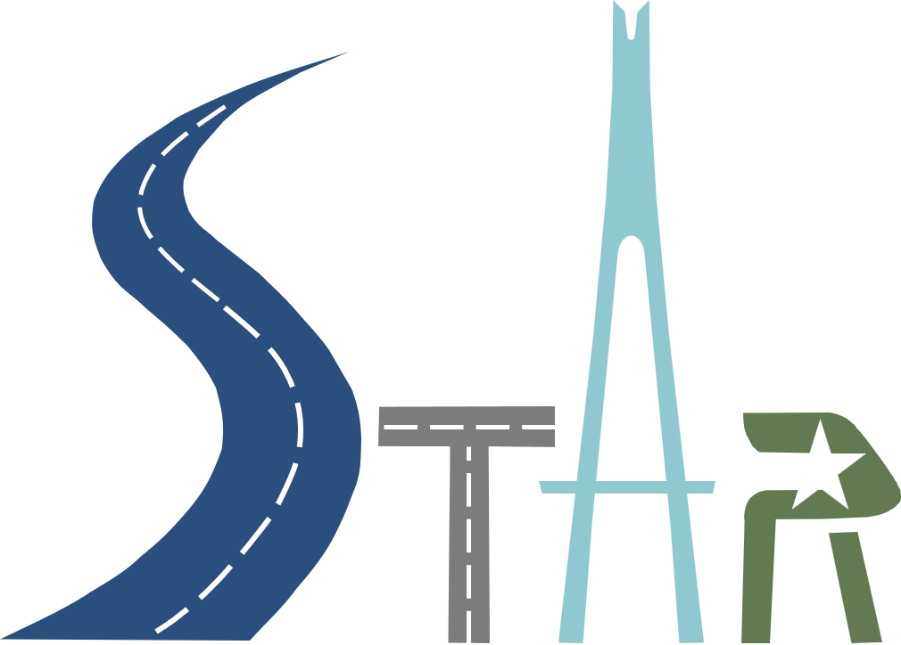

    

     
Interested students are encouraged to send his/her resume along with transcripts and proof materials (optional) directly to Dr. Li Song at `lisong1@whut.edu.cn`. 
Please feel free to refer to his [Chinese webpage](https://stle.whut.edu.cn/xygk/szdw/jgml/202210/t20221006_887992.shtml) for more detailed information. Review of applications will start immediately.
{: .notice}

Position Description:
------
**S**mart **T**ransportation **A**dvanced **R**esearch (STAR) Lab directed by Dr. Li Song in the Department of Transportation Engineering at the Wuhan University of Technology is seeking self-motivated graduate students (for master's degree). Potential research fields include but are not limited to:
* Intelligent Transportation Systems 
* Simulation and Control Methods for CAVs
* Big Data and Safety Analysis

Preferred Qualifications:
------
For the Master's Student Positions, applicants are preferred to have a B.S. in Transportation Engineering, Computer Science, Operations Research, or a related discipline. Applicants should possess the ability to work independently and in a team. Proficient scientific writing skills and fluency in English are highly recommended. Other desired qualifications should include, but are not limited to the following: 
* (1) Desire to break new ground and succeed; (具有创新突破精神，致力于攻读博士优先，或者致力于从事技术研发类工作)
* (2) Strong research interests in coding, traffic simulation, and machine learning technologies;  （对编程有浓厚的兴趣，对于交通控制算法、仿真二次开发、大数据分析技术等兴趣浓厚）
* (3) **Considerable programming experience (e.g., in Python, C/C++, Java, and/or MATLAB).** （具有一定的编程基础及经验，或者致力于学习编程技术）

About the STAR Center and WUT:
------
